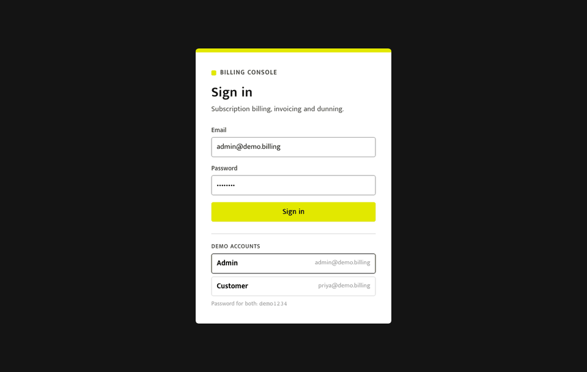
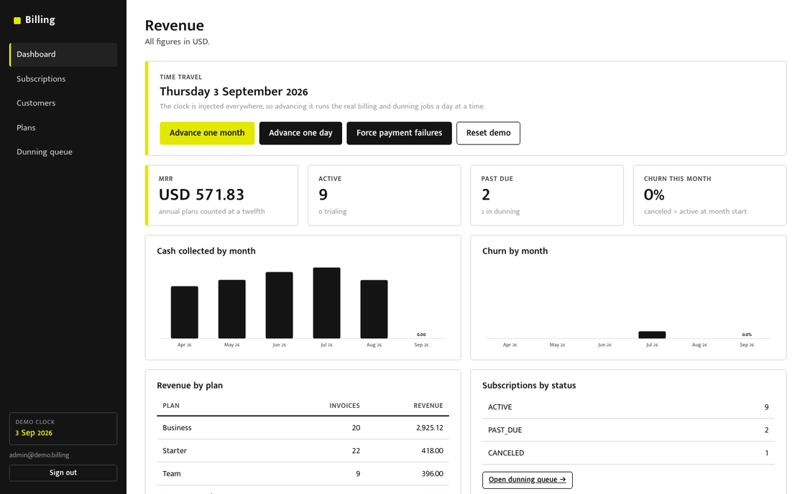
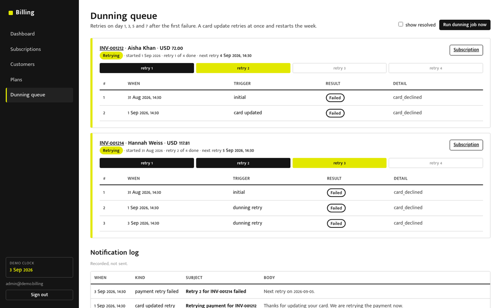
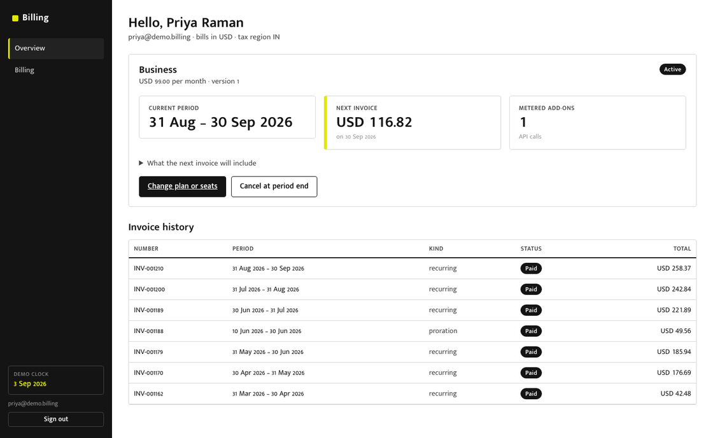
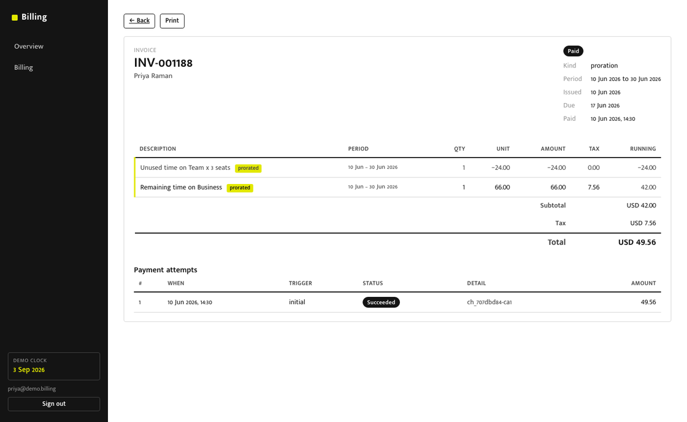
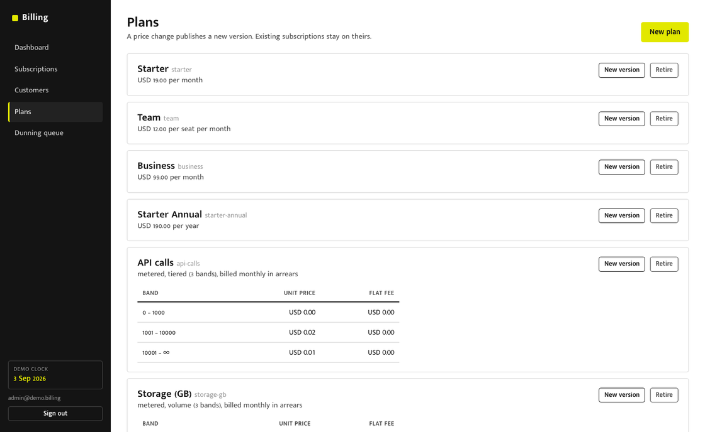
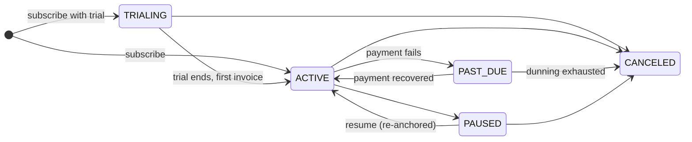
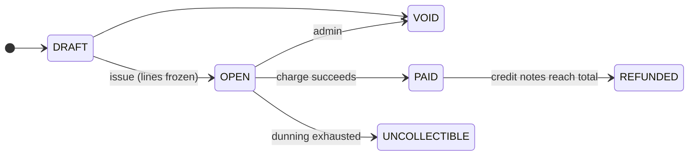
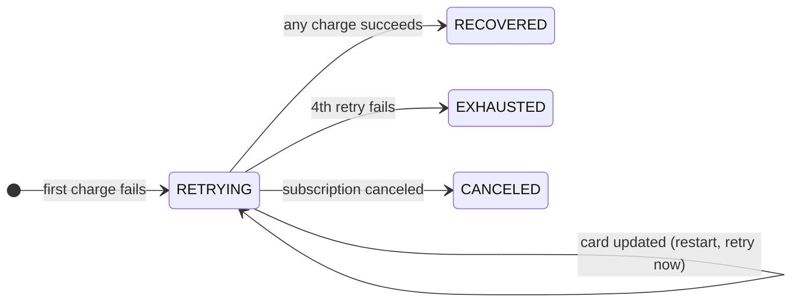
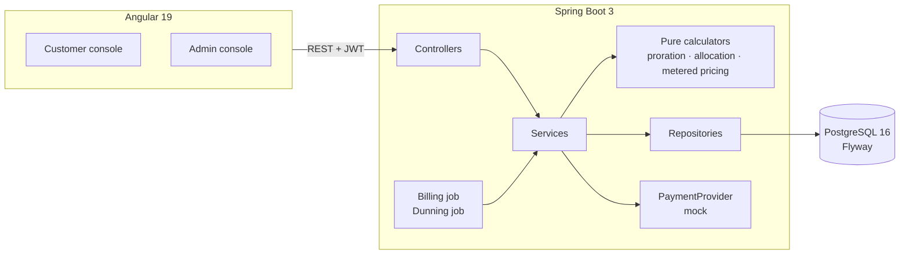

# Subscription Billing Engine

A subscription billing system built around the parts that are actually hard: recurring
invoices that are generated exactly once even when the job runs twice, mid-cycle plan changes
prorated so the maths comes out exact, usage metering with tiered and volume pricing, and a
failed-payment dunning sequence modelled as a real state machine. Java 21, Spring Boot 3,
PostgreSQL, Angular.

> No real payment rails. The provider is a mock you can tell to decline or time out, because
> the interesting engineering is in what happens *after* a payment fails.

**Live demo:** https://subscription-billing-engine-six.vercel.app (API docs: https://billing-backend-mhgp.onrender.com/swagger-ui.html)

The backend sleeps on Render's free tier after fifteen idle minutes; the first request takes about a minute to wake it and reseed the demo.

| Role | Email | Password |
|---|---|---|
| Admin | `admin@demo.billing` | `demo1234` |
| Customer | `priya@demo.billing` | `demo1234` |

**What to click first:** sign in as admin, press **Advance one month** on the dashboard, then
open **Dunning queue**. That is three months of billing history, a proration event and a
dunning sequence in about ninety seconds. The demo dataset is rebuilt from scratch on every
start and on **Reset demo**.




## Screenshots

| Admin dashboard, with the time-travel panel | Dunning queue, attempt history per case |
|---|---|
|  |  |

| Customer overview: current period, next invoice estimate, history | Invoice with proration lines marked and running totals |
|---|---|
|  |  |

| Plans: versioned prices, tiered and volume bands |
|---|
|  |

## Why this exists

Billing looks like CRUD and is not. Every one of these is a place a naive implementation is
quietly wrong, and every one has a test that proves this implementation is not:

- **The invoice job runs twice because of a deploy. Does the customer get charged twice?**
  No. Each due subscription is claimed with `SELECT ... FOR UPDATE SKIP LOCKED`, the period
  roll and the invoice insert commit together, and a partial unique index on
  `invoices (subscription_id, period_start)` is the final guard whatever the application
  believed. [`ConcurrentBillingIT`](backend/src/test/java/com/sharvary/billing/subscription/ConcurrentBillingIT.java)
  runs four copies of the job at once against twenty due subscriptions and asserts one new
  invoice each. [ADR 4](docs/adr/0004-database-unique-index-as-the-final-guard.md).
- **A customer upgrades on the 10th, downgrades on the 18th, upgrades again on the 25th. What
  do they owe?** Exactly the sum of each plan's price for the days it was active, to the cent.
  Proration is computed through a cumulative function (`owed(d) = floor(price·d/days)`, span
  = difference), so any partition of the period telescopes back to the full price. The pure
  [`ProrationCalculator`](backend/src/main/java/com/sharvary/billing/subscription/proration/ProrationCalculator.java)
  has no clock and no database; [`PlanChangeIT`](backend/src/test/java/com/sharvary/billing/subscription/PlanChangeIT.java)
  proves the equality end to end through real invoices and the credit balance.
  [ADR 2](docs/adr/0002-daily-proration-with-cumulative-rounding.md).
- **A subscription starts on 31 January. When does it bill next?** 28 February, then
  31 March, then 30 April. The anchor day is stored separately from the period dates, so it
  never drifts to the 28th. A jqwik property walks thirty-six periods from thousands of random
  start dates and asserts no day is skipped or repeated.
- **Three line items round to 33.33 but the invoice must total 100.00.** Largest-remainder
  allocation: floor every share, hand the leftover units to the largest fractional remainders.
  A property test asserts `sum(parts) == total` across thousands of random totals and weights,
  negatives included. It is what spreads invoice tax across lines so the per-line column adds
  up. [ADR 3](docs/adr/0003-largest-remainder-allocation.md).
- **A payment times out on retry 3 of 4. Did the charge go through?** Unknown, so the next
  attempt reuses the timed-out attempt's idempotency key and the provider reports what
  actually happened instead of charging again. The mock models a timeout that *did* charge;
  the test asserts the customer is charged exactly once.
  [ADR 7](docs/adr/0007-idempotent-retries-after-provider-timeout.md).
- **Money is never a float.** `Money` is `long minor` + `Currency`. Adding USD to EUR throws.
  Multiplying by a ratio requires an explicit rounding mode. `double` does not appear in the
  domain. [ADR 1](docs/adr/0001-money-as-integer-minor-units.md).
- **Time is injected.** Every service takes a `java.time.Clock`. Tests fix it; the demo
  profile swaps in a mutable one behind an admin endpoint, which is how the whole system became
  demonstrable. `grep -rn "now()" backend/src/main` finds the seeder's start point and the
  clock bean, nothing else. [ADR 8](docs/adr/0008-injected-clock.md).

## The two state machines

Every legal transition is listed in one enum; the entity asks it before changing state and
throws on anything else. The transition tables are tested exhaustively.





And the one that stops billing systems rotting into boolean flags, the dunning case:



`EXHAUSTED` writes the invoice off and cancels the subscription. `CANCELED` leaves the
invoice open: the debt is real and an admin can still collect it.
[ADR 6](docs/adr/0006-dunning-as-a-persisted-state-machine.md).

## Architecture



Packages are by domain, not by layer:

```
com.sharvary.billing
├── common/         Money, Allocation, idempotency, error handling
├── customer/       Customer, PaymentMethod
├── plan/           Plan, PlanVersion (immutable), PriceTier
├── subscription/   Subscription, BillingPeriods, BillingService, BillingJob
│   └── proration/  ProrationCalculator (pure)
├── invoice/        Invoice (immutable once issued), CreditNote, TaxRates
│   └── allocation/ InvoiceCalculator (pure)
├── usage/          UsageRecord (append-only), MeteredPricing (pure)
├── payment/        PaymentProvider, MockPaymentProvider, PaymentService
│   └── dunning/    DunningCase, DunningService, DunningJob, RetrySchedule
├── auth/           JWT, roles, customer scoping
├── reporting/      MRR, churn, revenue by plan (SQL)
├── demo/           seeder and time-travel endpoints (demo profile only)
└── config/         Clock, security, Jackson, OpenAPI
```

Controllers parse and validate; services hold every business rule; repositories are the only
thing that touches persistence; the calculators have no dependencies at all.

## Policies you should know about

These are the decisions with no single right answer. Each is written up in `docs/adr/`.

| Question | Answer |
|---|---|
| Proration granularity | Calendar day |
| Upgrade | Invoiced immediately for the prorated difference, charged at once |
| Downgrade | Net credit goes to the customer's balance; drawn on the next invoice, never refunded |
| Credit bigger than the next invoice | Stays on the balance and keeps drawing down |
| Plan charge timing | In advance, at period start |
| Usage timing | In arrears, for the period just closed, on the same invoice |
| Usage stamped into a closed period | Rejected (422). The invoice for that period is immutable |
| Tiered vs volume | Tiered charges each band's units at its rate; volume charges everything at the reached band's rate. Both implemented; they diverge at the boundary and the test shows it |
| Correcting a paid invoice | Credit note (append-only document, refund through provider). Open invoices are voided instead |
| Retry schedule | Days 1, 3, 5, 7 from the first failure, measured from the start, not the previous attempt |
| Card updated mid-sequence | Retry immediately, restart the week |
| Dunning exhausted | Invoice `UNCOLLECTIBLE`, subscription `CANCELED`, customer notified |
| Cancel mid-dunning | Retries stop; the invoice stays `OPEN` |
| Pause then resume after the period lapsed | New period starts today, re-anchored to today, invoiced in full |
| Tax | Static rate by region, on the net positive subtotal, spread over lines by allocation |
| Notifications | Recorded in a table and logged, never sent |

## Tech stack

| Layer | Choice |
|---|---|
| Language | Java 21 (records, sealed switch, pattern matching) |
| Framework | Spring Boot 3.5, Spring MVC, Spring Data JPA over Hibernate |
| Database | PostgreSQL 16, Flyway migrations written by hand, `ddl-auto: none` |
| Frontend | Angular 19, standalone components, signals, typed reactive forms, an HTTP interceptor for the JWT |
| Auth | Spring Security, JWT (jjwt), roles `ADMIN` / `CUSTOMER`; customers are scoped to their own rows and a foreign id is a 404, not a 403 |
| Scheduling | `@Scheduled` with `SKIP LOCKED` claiming; no extra infrastructure |
| Testing | JUnit 5, AssertJ, Mockito, jqwik, Testcontainers, MockMvc |
| Coverage | JaCoCo, build fails below 80% line coverage on domain and service code (DTOs, config, controllers and the demo seeder excluded) |
| API docs | springdoc OpenAPI at `/swagger-ui.html` |
| Containers | Docker, Docker Compose; Kubernetes manifests in `k8s/` |
| CI | GitHub Actions: build, full test suite with coverage gate, frontend build, container builds |

## Testing

119 tests, four layers, all green under `mvn verify`. Current coverage is 94.9% line and
86.2% branch across the gated packages.

| Layer | What | Where |
|---|---|---|
| Unit (no Spring, under a second) | `Money`, allocation, proration, billing periods, all three state-machine tables, tiered/volume pricing, invoice calculator, retry schedule, dunning case, mock provider, plan validation | `*Test.java` |
| Property (jqwik) | parts always sum to the total; used + unused always equals the full price; any partition of a period sums exactly; credit never exceeds the old price; billing periods never skip or repeat a day | `*Properties.java` |
| Integration (Testcontainers, real Postgres) | concurrent billing, the unique index alone, rollback on mid-rollover failure, Flyway from empty, the full monthly cycle across February, trials, cancellation, pause/resume, usage in arrears, plan changes, credit notes, the whole dunning matrix | `*IT.java` |
| API (`@SpringBootTest` + MockMvc) | 401/403, the IDOR 404, validation errors with field detail, idempotency replay and same-key-different-body refusal, usage ownership, admin and customer happy paths | `api/ApiIT.java` |

The three tests to look at first:

1. `ConcurrentBillingIT.twoJobInstancesRunningTogetherProduceOneInvoicePerSubscription`
2. `PlanChangeIT.upgradeThenDowngradeThenUpgradeChargesExactlyThePerPlanDurations`
3. `AllocationProperties.partsAlwaysSumToTheTotal`

```bash
cd backend
mvn verify                      # everything, with the coverage gate (needs Docker for Testcontainers)
mvn test -Dtest='*Test,*Properties'   # just the fast ones
```

## Running locally

### Docker Compose

```bash
docker compose up --build
```

Postgres, the API (demo profile, seeded on start) and the console. Open
http://localhost:8081 and sign in with the demo accounts above. API docs at
http://localhost:8080/swagger-ui.html.

### Dev loop

```bash
docker compose up -d postgres

cd backend
mvn spring-boot:run -Dspring-boot.run.profiles=demo     # http://localhost:8080

cd frontend
npm install
npm start                                               # http://localhost:4200, proxies /api
```

Configuration is by environment variable; see `backend/src/main/resources/application.yml`
for the full list (`DATABASE_URL` or `DB_HOST`/`DB_PORT`/`DB_NAME`, `DATABASE_USER`,
`DATABASE_PASSWORD`, `JWT_SECRET`, `CORS_ALLOWED_ORIGINS`, `BILLING_CRON`, `DUNNING_CRON`).

## The API

Everything is under `/api`. Writes a client might retry take an `Idempotency-Key` header.

| Area | Endpoints |
|---|---|
| Auth | `POST /auth/login`, `GET /auth/me` |
| Customer (own data only) | `GET /me`, `/me/subscriptions`, `/me/subscriptions/{id}/estimate`, `POST /me/subscriptions/{id}/change`, `/cancel`, `/undo-cancel`, `GET /me/invoices`, `/me/invoices/{id}`, `/attempts`, `/credit-notes`, `POST /me/invoices/{id}/pay`, `/me/payment-methods`, `/me/notifications` |
| Plans | `GET /plans` (active), admin CRUD and `POST /admin/plans/{id}/versions` |
| Admin | `/admin/customers`, `/admin/subscriptions` (search, subscribe, change, cancel, pause, resume), `/admin/invoices` (pay, void, credit notes, attempts), `/admin/dunning`, `/admin/notifications`, `/admin/reports/dashboard`, `/admin/jobs/{billing,dunning}/run` |
| Usage | `POST /usage` (idempotent, rejects closed periods), `GET /usage/items/{id}` |
| Demo (profile `demo`) | `GET /demo/info`, `POST /demo/advance {days}`, `/demo/payment-mode {mode}`, `/demo/reset` |

Worked example, a plan change:

```http
POST /api/me/subscriptions/{id}/change
{"planVersionId": "<business v1>", "quantity": 1}

200
{
  "subscription": {...},
  "invoice": {
    "kind": "PRORATION",
    "lines": [
      {"type": "PRORATION_CREDIT", "description": "Unused time on Team x 3 seats", "amount": {"amount": "-24.00", ...}, "proration": true},
      {"type": "PRORATION_CHARGE", "description": "Remaining time on Business",   "amount": {"amount": "66.00",  ...}, "proration": true}
    ],
    "subtotal": {"amount": "42.00"}, "tax": {"amount": "7.56"}, "total": {"amount": "49.56"}, "status": "PAID"
  },
  "credited": {"amount": "24.00"}, "charged": {"amount": "66.00"}
}
```

## Kubernetes

`k8s/` has a Namespace, ConfigMap, Secret, a two-replica backend Deployment with readiness
and liveness probes, a Service, a HorizontalPodAutoscaler, a CronJob that triggers the
billing run, and the frontend. It runs on kind or minikube:

```bash
kind create cluster
docker build -t billing-backend:local backend
docker build -t billing-frontend:local frontend
kind load docker-image billing-backend:local billing-frontend:local
kubectl apply -f k8s/
kubectl -n billing port-forward svc/billing-frontend 8081:80
```

Two replicas both run the in-process scheduler on purpose. Scale to two, advance the demo
clock, and check the invoices table: one row per subscription per period. The `SKIP LOCKED`
claiming is doing real work here, not decoration. The deploy target is a PaaS for cost
reasons; the manifests exist because they were written and tested, not because a cluster is
running.

## Deploying

Backend and Postgres on Render (free tier), the Angular build on Vercel (free tier). Both
configs are in the repo.

1. Render: **New → Blueprint**, pick this repo. `render.yaml` creates `billing-db` and
   `billing-backend` (Docker, demo profile, JWT secret generated). Note the service URL.
2. Vercel: import the repo with root directory `frontend`, framework Angular, output
   `dist/frontend/browser`. `frontend/vercel.json` rewrites `/api/*` to the Render URL; edit
   that hostname if Render gave you a different one.
3. Put the Vercel URL into `CORS_ALLOWED_ORIGINS` on the Render service.

Free-tier notes: the Render service sleeps after fifteen minutes idle (first request takes a
minute and reseeds the demo), and the free Postgres expires after thirty days.

## Repository layout

```
backend/       Spring Boot service, Flyway migrations, tests
frontend/      Angular console
docs/adr/      architecture decision records, one per real decision
docs/glossary.md
k8s/           Kubernetes manifests
.github/       CI
docker-compose.yml, render.yaml
```
